# Hybrid Athlete Analysis & Recommendations: BurpeePacer Program

This analysis evaluates the **BurpeePacer** program design from the perspectives of a **Burpee Coach**, a **Bodybuilder**, and a **Runner**. It provides actionable recommendations for individuals seeking to build muscle and run effectively using this program.

---

## 1. Program Overview & Physiology

The BurpeePacer workout structure—as defined in [WORKOUT_SPECIFICATION.md](file:///Users/krishnapradhan/projects/burpee-pacers/ios/BurpeePacer/WORKOUT_SPECIFICATION.md)—is built around a **20-minute time-capped session** performed 3 days a week (Monday, Wednesday, Friday).

### Workout Tracks

- **Beginner Track:** Focuses on volume without pushups (`fiveCount` mode without pushups).
- **Advanced Track:** Focuses on Navy Seals (`N` - typically 3 pushups/rep), 5-Count Pushups (`C` - 1 pushup/rep), or Hybrid (`H` - 10 mins Navy Seals + 10 mins 5-Count).

### The Pacer Metronome

The app acts as a metronome to regulate workout intensity:
$$\text{Interval} = \frac{\text{Total Seconds}}{\text{Goal}}$$
$$\text{Next Rep Boundary} = (\text{Current Rep} + 1) \times \text{Interval}$$

> [!NOTE]
> Pacing is the secret to building high-volume aerobic capacity. By warning the athlete 4 seconds before each rep boundary, the app prevents premature muscle failure (redlining), allowing for higher total volume.

---

## 2. The "No-Jump" Factor: A Strategic Advantage

Traditional burpees end with a vertical jump and a high-impact landing. In this app's workouts, the user stands up to full extension without jumping. This modification is highly advantageous for concurrent training.

### Runner's Perspective: Joint Longevity

- **Zero Added Landing Impact:** Running already subjects the lower body to thousands of high-impact cycles. Adding up to 325 vertical landings (as in the Advanced Graduation level) on off-days would severely stress the knees, Achilles tendons, and shins.
- **Injury Prevention:** Removing the jump makes the burpee a low-impact conditioning tool. This allows runners to train their cardiovascular engine on recovery days without overloading joints already fatigued by mileage.
- **Active Recovery:** The continuous squatting and standing movement flushes lactic acid, promotes blood flow, and encourages hip extension (reversing the hip-flexor tightness common in runners).

### Bodybuilder's Perspective: Targeted Tension

- **High Muscular Yield:** Jumps consume high amounts of systemic energy without contributing to hypertrophy. Eliminating the jump preserves energy for the concentric/eccentric components of the squat and pushup.
- **Hypertrophy Focus:** Energy saved on jumping can be redirected to the **Strength Finishers** where localized mechanical tension and progressive overload are maximized.

### Coach's Perspective: Pacing & Volume

- **Elevated Rep Capacity:** Eliminating the vertical jump decreases the time per rep. This allows athletes to hit high-density targets (such as 325 reps in 20 minutes) safely.
- **Form Preservation:** When fatigue sets in, jump mechanics degrade, risking ankle or knee sprains. Removing the jump keeps the movement safe even during the final minutes of a grueling session.

---

## 3. Recommendations for Muscle Building (Bodybuilder)

To maximize muscle growth while following this program, implement the following adjustments:

| Component                | Target                                              | Strategy                                                                                                                                                                                                                                                                                   |
| :----------------------- | :-------------------------------------------------- | :----------------------------------------------------------------------------------------------------------------------------------------------------------------------------------------------------------------------------------------------------------------------------------------- |
| **Protein Intake**       | $1.6 - 2.2 \text{ g/kg}$ ($0.8 - 1.0 \text{ g/lb}$) | Increase the app's default baseline ($1.5 \text{ g/kg}$) to prevent muscle catabolism from the combined load of burpees and running.                                                                                                                                                       |
| **Strength Finishers**   | 3-4 sets of 8-12 reps                               | Treat the finishers (defined in [WORKOUT_SPECIFICATION.md](file:///Users/krishnapradhan/projects/burpee-pacers/ios/BurpeePacer/WORKOUT_SPECIFICATION.md#L81-L98)) as your primary hypertrophy stimulus. Focus on slow, controlled eccentrics (3-second lowering) and progressive overload. |
| **Pull-to-Push Balance** | 1:1 Ratio                                           | Since Navy Seals and 5-Counts are heavily chest/shoulder-dominant, never skip the **Friday Pull Focus** (weighted pullups and dumbbell rows) to prevent shoulder impingement and maintain postural symmetry.                                                                               |

> [!TIP]
> Since burpees are highly aerobic, perform the **Strength Finishers** after a 5-minute transition rest post-workout. If your primary goal is muscle size, ensure you are eating at a slight caloric surplus ($250 - 500 \text{ kcal}$ above maintenance) to offset the high burn rate of burpees and running.

---

## 4. Recommendations for Running (Runner)

To integrate running with the BurpeePacer routine, follow a structured concurrent training weekly split:

```mermaid
gantt
    title Hybrid Athlete Weekly Split
    dateFormat  X
    axisFormat %d
    section Workout Days
    Burpees + Finishers (M/W/F) :active, 0, 1
    Rest/Recovery (Su)          :crit, 6, 7
    section Running Days
    Easy Zone 2 Run (T/Th)      :w1, 1, 2
    Long Run (Sa)               :w2, 5, 6
```

### Actionable Training Rules:

1. **Keep Easy Runs Easy:** Your Tuesday and Thursday runs should be strictly in **Zone 2** (conversational pace). This builds aerobic base and aids recovery without adding unnecessary fatigue to your legs before Wednesday and Friday burpee sessions.
2. **Utilize Wednesday Leg Focus for Prehab:** The Wednesday finishers—like **Bulgarian Split Squats** and **Lunges**—strengthen stabilizer muscles around the hips and knees. Focus on form to correct imbalances and prevent runner's knee.
3. **Protect Your Recovery Window:** Ensure Sunday is a complete rest day. Your body needs a full 24-hour cycle of zero impact to adapt to both strength and endurance stressors.

---

## 5. Conclusion & Verdict

The **BurpeePacer** app provides a highly viable framework for building a lean, functional, and well-conditioned physique.

- **Can you build muscle?** Yes. You will build an athletic, dense upper body (chest, front delts, triceps, core) and strong leg stabilizers, particularly when utilizing the dumbbell strength finishers.
- **Can you be a decent runner?** Yes. The 20-minute paced sessions build exceptional cardiovascular threshold and VO2 max, while the **no-jump variation** keeps your joints healthy and free from impact-related overuse injuries.

For a true **hybrid athlete** who wants to strike a balance between strength, conditioning, and road running, this program is an exceptional choice.
