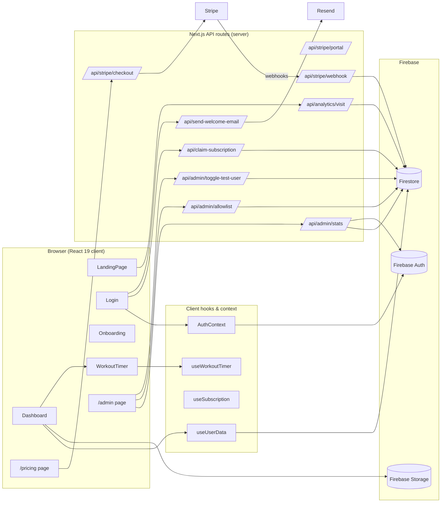
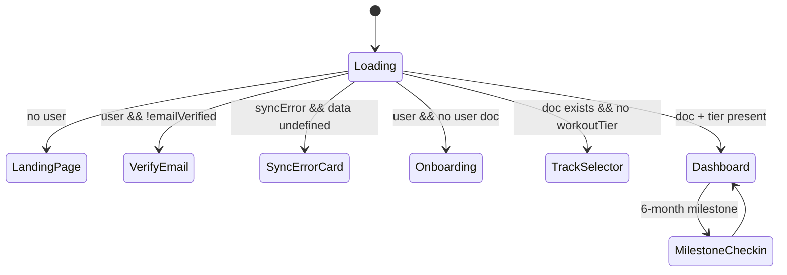
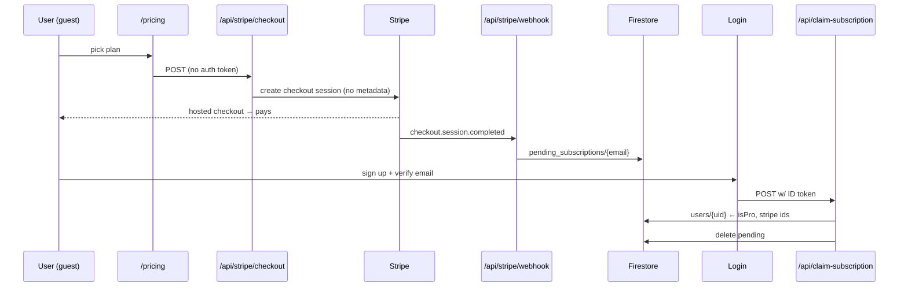
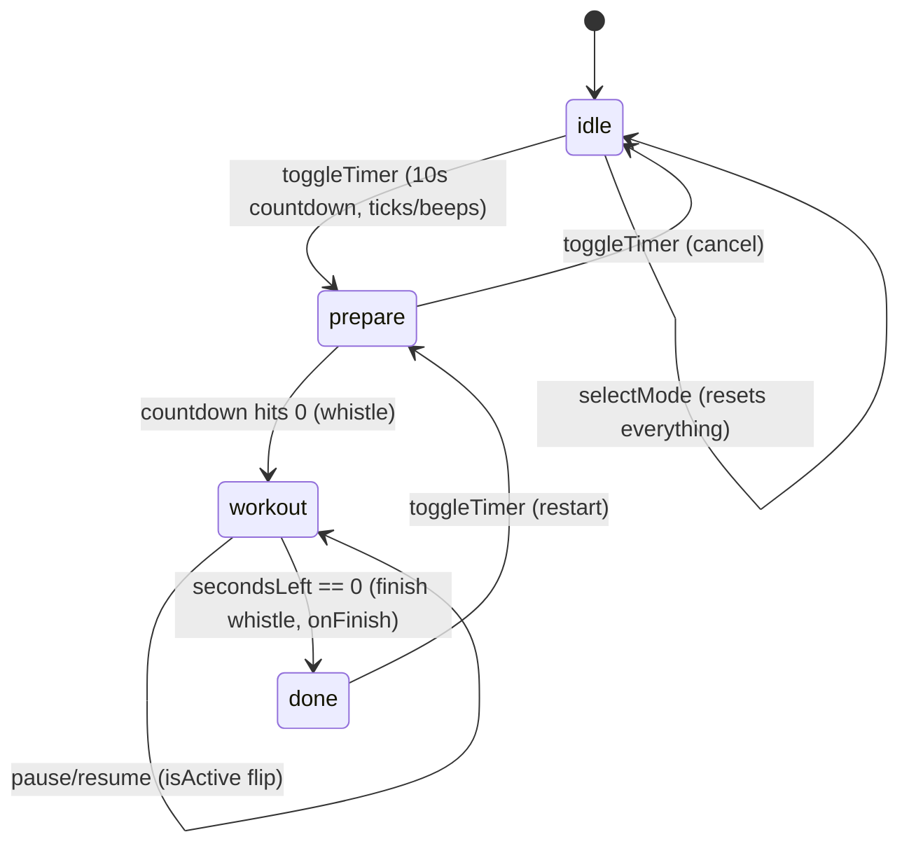

# BurpeePacer Web — Architecture & Design

_Date: 2026-07-07 · Scope: `web/` (Next.js 16 app) only._

## 1. System Overview

**Two data paths, one document.** All user state lives in a single Firestore doc `users/{uid}`. The client reads/writes it directly via the Firebase JS SDK (`lib/db.ts`, guarded by `firestore.rules`); server routes write it via the Admin SDK (bypasses rules) for subscription and admin fields.

## 2. App Shell Routing (`app/page.tsx`)

State-driven, not URL-driven:

## 3. Auth & Authorization

- **Client auth**: Firebase Auth (email/password + Google popup) via `AuthContext`. Email verification is enforced by the shell (unverified users see a blocking card).
- **Server auth**: every API route expects `Authorization: Bearer <Firebase ID token>`, verified with `firebase-admin`'s `verifyIdToken`.
- **Admin gating** (two parallel lists — intentional split):
  - Client UI affordances: `NEXT_PUBLIC_ADMIN_EMAILS` via `lib/allowlist.ts` (`isAdmin`).
  - Server authorization: `ADMIN_EMAILS` via `lib/admin-emails.ts` (`isServerAdmin`) — the real gate for `/api/admin/*`.
- **Free-Pro allowlist**: env `ALLOWLISTED_EMAILS` (server-only) + Firestore `allowlisted_emails` collection managed from `/admin`; checked server-side by `lib/allowlist-server.ts`.
- **Launch mode**: `Dashboard.tsx` hardcodes `isPro = true`; `useSubscription` and `ProGate` are retained plumbing for when paid plans return.

## 4. Subscription Flows (Stripe)

Logged-in checkout is the same, except the session carries `metadata.firebaseUserId`, so the webhook writes `users/{uid}` directly and renewals/cancellations resolve via subscription metadata.

**Webhook event handling** (`/api/stripe/webhook`, signature-verified):

| Event | Effect on `users/{uid}` |
|---|---|
| `checkout.session.completed` | `isPro: true`, status `active` (or pending-by-email for guests) |
| `invoice.payment_succeeded` | `isPro: true`, `active` |
| `invoice.payment_failed` | `isPro: false`, `past_due` |
| `customer.subscription.deleted` | `isPro: false`, `canceled` |

> Note: the last three resolve the user via `subscription.metadata.firebaseUserId`, which guest-checkout subscriptions never receive — see finding H-2 in the code review.

## 5. Workout Timer Design

`buildWorkoutTimerConfig()` (`lib/workoutTimer.ts`) is a pure config builder: tier + level goals → modes (`N`/`C`/`H`) with per-mode goals; Hybrid gets two 10-min phases at `ceil(goal/2)` each. `useWorkoutTimer` is the state machine; the `WorkoutTimer/*` components are dumb renderers.

Key mechanics:
- Reps are **pace-derived**, not user-counted: `repsCompleted = floor(elapsed / intervalSeconds)`; warning beeps fire 4–1s before each boundary, whistle at the boundary.
- **Hybrid**: phase index is derived purely from `secondsLeft` (first vs last 600s); rep counter resets at the crossover; `onFinish` reports phase-2 goal.
- `onFinish` flows up to `Dashboard`, which logs today's workout through `useUserData.toggleWorkoutLog` with `repsCompleted` (this marks it "timer verified" in stats).

## 6. Data Model (`users/{uid}`)

Written by client (rules-gated): `startDate`, `startWeight`, `startPictureUrl`, `workoutTier`, `currentLevelId`, `workoutDays[]`, `workoutLogs[]`, `workoutStats`, `endDate`/`endWeight`/`endPictureUrl`.
Written by server only (rules block client): `isPro`, `stripeCustomerId`, `stripeSubscriptionId`, `subscriptionStatus`, `trialEndsAt`.

`workoutLogs` is an **array on the doc** (not a subcollection); every save rewrites the whole array via `setDoc(merge)`. Fine at current scale (~3 logs/week), but it's the concurrency/size hot spot — see review M-8.

Other collections: `pending_subscriptions/{email}`, `allowlisted_emails/{email}`, `analytics/stats` — all server-only (client access denied by rules).

## 7. Trust Boundaries

| Boundary | Enforcement |
|---|---|
| Client ↔ Firestore | `firestore.rules`: own-doc only; subscription fields blocked |
| Client ↔ API routes | Firebase ID token verification per-route |
| Admin routes | `ADMIN_EMAILS` (server env) + `email_verified` |
| Stripe ↔ webhook | Signature check with `STRIPE_WEBHOOK_SECRET` |
| Client ↔ Storage | `storage.rules` — **not present in repo** (see review) |

## 8. Known Design Tensions

1. **Level scheme divergence**: web ships `F,1,2,3,4,E` (Foundation–Elite) and `B1–B6` with goals that differ from the `1A–grad` scheme documented in the root CLAUDE.md and used by iOS/Android. `currentLevelId` is shared via Firestore, so a level set on web may not resolve on iOS. Needs a cross-platform decision, not a web-only fix.
2. **Dual allowlists** (`NEXT_PUBLIC_ADMIN_EMAILS` vs `ADMIN_EMAILS`, env vs Firestore allowlist) are easy to misconfigure; client `isAllowlisted()` can never see `ALLOWLISTED_EMAILS` (server-only env), so it silently degrades to admins-only in the browser.
3. **Launch mode** is implemented as a hardcoded `isPro = true` in Dashboard rather than a feature flag; re-enabling payments means hunting for scattered launch-copy and the commented-out `useSubscription` call.
